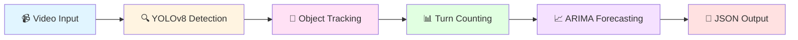

<div align="center">

# TurnSight

### Vehicle Tracking across Turns and Junctions

[](https://ieee-dataport.org/competitions/bengaluru-mobility-challenge-2024)
[](https://dataforpublicgood.org.in/bengaluru-mobility-challenge-2024/)
[](https://www.python.org/)
[](https://github.com/ultralytics/ultralytics)
[](https://www.docker.com/)
[](./LICENSE)

**🏆 Phase 1 Winners of The Bengaluru Mobility Challenge**

</div>

---

## 👥 Team "GetFined"

**RV College of Engineering**

| Member | Role |
|--------|------|
| Tarun Bhupathi | Team Member |
| Sundarakrishnan N | Team Member |
| Sohan Varier | Team Member |
| Manaswini SK | Team Member |

📄 **[Detailed Report](https://drive.google.com/file/d/1YZztqHRN1J5TLh3QNKnYMgrsRQ3Dhf7d/view?usp=drive_link)** | 🌐 **[Event Details](https://dataforpublicgood.org.in/bengaluru-mobility-challenge-2024/)**

---

## 📑 Table of Contents

- [About](#-about)
- [Tech Stack](#-tech-stack)
- [Problem Statement](#-problem-statement)
- [Pipeline Architecture](#-pipeline-architecture)
- [Quick Start](#-quick-start)
- [Scripts and Files](#-scripts-and-files)
- [Requirements](#-requirements)
- [Docker](#-docker)
- [System Requirements](#-system-requirements)
- [Open-Source Tools](#-open-source-tools)
- [Citation](#-citation)

---

## 🎯 About

TurnSight is an advanced vehicle tracking and prediction system that analyzes traffic patterns at road junctions using computer vision and machine learning. Built for the Bengaluru Mobility Challenge 2024, this solution provides real-time vehicle detection, tracking across turns, and short-term traffic forecasting.

---

## 🛠 Tech Stack

<div align="center">

| Technology | Purpose |
|------------|---------|
|  | Real-time Object Detection |
|  | Core Programming Language |
|  | Video Processing |
|  | Data Analysis |
|  | Containerization |
|  | GPU Acceleration |

</div>

---

## 📋 Problem Statement

The Bengaluru Mobility Challenge Phase 1 required participants to analyze camera feeds from **23 Safe City cameras** in northern Bengaluru (around IISc campus) and provide:

- **Short-term predictions** (30 minutes into the future) of vehicle counts by type
- **Vehicle turning patterns** at junctions and key points
- **Predictions at locations** different from camera feed locations

---

## 🔄 Pipeline Architecture



**Workflow:**
1. **Input**: Video feeds from traffic cameras
2. **Detection**: YOLOv8 identifies 7 vehicle classes
3. **Tracking**: Custom counter tracks vehicles across frames
4. **Counting**: Turning patterns counted at junctions
5. **Forecasting**: ARIMA model predicts future counts
6. **Output**: Structured JSON with counts and predictions

---

## 🚀 Quick Start

### Installation

```bash
# Install dependencies
pip3 install -r requirements.txt
```

### Usage

```bash
python3 app.py input.json output.json
```

### Input Format

```json
{
   "Cam_ID": {
       "Vid_1": "/app/data/Cam_ID_vid_1.mp4",
       "Vid_2": "/app/data/Cam_ID_1_vid_2.mp4"
   }
}
```

---

## 📂 Scripts and Files

### Core Program Scripts

| Script | Description |
|--------|-------------|
| **app.py** | 🎯 Main driver code - entry point for the pipeline |
| **best.pt** | 🤖 Trained YOLOv8 model for 7 vehicle classes |
| **config.py** | ⚙️ Junction coordinates and detection box configurations |
| **outputTemplate.py** | 📄 Output format template for submission |
| **customCounter.py** | 🔢 Modified Ultralytics counter for custom tracking |
| **video_processor.py** | 🎬 VideoProcessor class for detection, tracking & counting |
| **forecasting.py** | 📈 Forecaster class with ARIMA prediction model |
| **output_handler.py** | 💾 Output processing and JSON formatting |

> **Note:** Only `app.py` should be run directly. Other files are dependencies.

### Development & Utility Scripts

<details>
<summary>Click to expand utility scripts</summary>

| Script | Purpose |
|--------|---------|
| **extract_images.py** | Extract frames from videos for training |
| **auto_annotate.py** | Automated annotation using base model |
| **data_split.py** | Split dataset into train/test/validation |
| **stream.py** | Real-time YOLO prediction visualization |
| **capture_coordinates.py** | Interactive tool for junction box creation |
| **view.py** | Visualize turning boxes on junction images |
| **data.yaml** | Dataset configuration and class definitions |
| **predict_arima.py** | ARIMA model testing and parameter tuning |
| **data_combine.py** | Merge annotated datasets from team members |

</details>

---

## 📦 Requirements

### Core Dependencies

| Package | Version | Purpose |
|---------|---------|---------|
| **opencv-python-headless** | 4.10.0.84 | Video file processing |
| **ultralytics** | 8.2.58 | YOLOv8 detection framework |
| **pandas** | 1.5.3 | Data structure and analysis |
| **pmdarima** | 2.0.4 | Auto-ARIMA forecasting |
| **Shapely** | 2.0.6 | Geometric operations (Ultralytics dependency) |
| **statsmodels** | 0.14.2 | Statistical modeling and smoothing |

### Development Dependencies

<details>
<summary>Additional packages for development scripts</summary>

| Package | Version | Purpose |
|---------|---------|---------|
| **matplotlib** | 3.7.1 | Plotting and visualization |
| **numpy** | 2.1.0 | Array operations |
| **prophet** | 1.1.5 | Facebook's forecasting tool |
| **scikit-learn** | 1.0.2 | ML utilities and data splitting |
| **opencv-python** | 4.10.0.84 | Video display and processing |

</details>

### Installation

```bash
pip3 install -r requirements.txt
```

---

## 🐳 Docker

The project includes a Dockerfile with CUDA support for GPU acceleration.

### Build Image

```bash
docker build -t username/turnsight:latest .
```

### Push to Registry

```bash
docker push username/turnsight:latest
```

### Run Container

```bash
docker run --rm --runtime=nvidia --gpus all \
  -v '/path/to/data':/app/data \
  username/turnsight:latest \
  python3 app.py input.json output.json
```

> The container automatically handles GPU access and mounts your data directory.

---

## 💻 System Requirements

| Component | Minimum Specification |
|-----------|----------------------|
| **CPU** | Intel Core i5 or equivalent |
| **GPU** | NVIDIA GTX 1650 (1GB VRAM for inference) |
| **RAM** | 8 GB |
| **Storage** | 10 GB available space |
| **OS** | Linux/Windows with Docker support |

> **Note:** GPU is recommended for real-time performance. CPU-only mode is supported but slower.

---

## 🌟 Open-Source Tools

This project is built on excellent open-source software:

- **[YOLOv8](https://github.com/ultralytics/ultralytics)** by Ultralytics - Real-time object detection and image segmentation
- **[LabelImg](https://github.com/heartexlabs/labelImg)** - Annotation tool for bounding boxes in YOLO format

---

## 📚 Citation

If you use this project in your research or work, please cite:

```bibtex
@ARTICLE{10830516,
  author={Narayanan, Sundarakrishnan and Varier, Sohan and Bhupathi, Tarun and Simhadri Kavali, Manaswini and Mohana and Ramakanth Kumar, P. and Sreelakshmi, K.},
  journal={IEEE Access}, 
  title={Vehicle Turn Pattern Counting and Short Term Forecasting Using Deep Learning for Urban Traffic Management System}, 
  year={2025},
  volume={13},
  number={},
  pages={8585-8593},
  keywords={Urban areas;Predictive models;Turning;Roads;Forecasting;Cameras;Accuracy;Tracking;Real-time systems;Adaptation models;Auto-ARIMA;deep learning;object tracking;time-series analysis;traffic forecasting;YOLOv8;urban traffic management;vehicle turn pattern counting},
  doi={10.1109/ACCESS.2025.3526880}}
```

See [CITATION.cff](./CITATION.cff) for more details.

---

## 📄 License

This project is licensed under the BSD 3-Clause License - see the [LICENSE](./LICENSE) file for details.

---

## 🙏 Acknowledgments

- **Bengaluru Mobility Challenge 2024** organizers
- **Data for Public Good** initiative
- **IEEE DataPort** for hosting the competition
- **RV College of Engineering** for support and resources

---

<div align="center">

[Competition](https://ieee-dataport.org/competitions/bengaluru-mobility-challenge-2024) • [Report](https://drive.google.com/file/d/1YZztqHRN1J5TLh3QNKnYMgrsRQ3Dhf7d/view?usp=drive_link) • [Event Details](https://dataforpublicgood.org.in/bengaluru-mobility-challenge-2024/)

</div>
