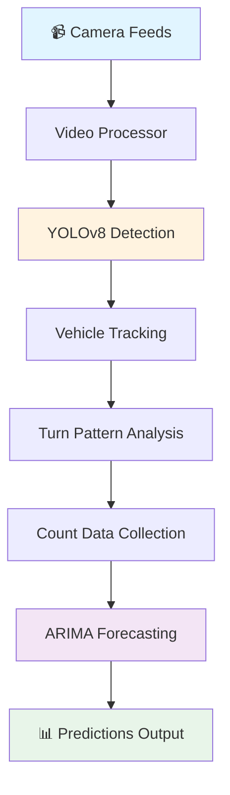

<div align="center">

# 🚦 TurnSight

### AI-Powered Traffic Analysis & Prediction System


**[The Bengaluru Mobility Challenge 2024](https://ieee-dataport.org/competitions/bengaluru-mobility-challenge-2024)**

---

### 🏆 Team "GetFined"

**Winners of Phase 1 - The Bengaluru Mobility Challenge**

**Team Members:** Tarun Bhupathi • Sundarakrishnan N • Sohan Varier • Manaswini SK  
**Institution:** RV College of Engineering

📄 [**Detailed Report**](https://drive.google.com/file/d/1YZztqHRN1J5TLh3QNKnYMgrsRQ3Dhf7d/view?usp=drive_link) • 🔗 [**Event Details**](https://dataforpublicgood.org.in/bengaluru-mobility-challenge-2024/)

</div>

---

## 📋 Table of Contents

- [✨ Highlights](#-highlights)
- [🎯 Problem Statement](#-problem-statement)
- [🏗️ System Architecture](#️-system-architecture)
- [🛠️ Technology Stack](#️-technology-stack)
- [📂 Scripts and Files](#-scripts-and-files)
  - [Program Scripts](#program-scripts)
  - [Other Scripts](#other-scripts)
- [📦 Requirements](#-requirements)
- [🐳 Docker](#-docker)
- [💻 System Requirements](#-system-requirements)
- [🙏 Acknowledgments](#-acknowledgments)

---

## ✨ Highlights

🎯 **Real-time Vehicle Detection** - Custom trained YOLOv8 model detecting 7 vehicle classes  
📊 **Traffic Pattern Analysis** - Advanced turning pattern detection at junctions  
🔮 **Short-term Forecasting** - 30-minute predictive analytics using ARIMA models  
🎥 **Multi-camera Support** - Processes feeds from 23 Safe City cameras  
🐳 **Docker Containerized** - Easy deployment with CUDA GPU support  
⚡ **Optimized Performance** - Efficient real-time inference on standard hardware

---

## 🎯 Problem Statement

> The participants in this phase will be provided with camera feeds from **23 Safe City cameras** in northern Bengaluru, around the IISc campus. The task will be to provide **short-term (e.g., 30 minutes into the future) predictions** of the vehicle counts (by vehicle type) as well as **vehicle turning patterns** at certain points and junctions of the road network. The predictions may be at different points different from the locations where the camera feeds are available.
---

## 🏗️ System Architecture



---

## 🛠️ Technology Stack

<div align="center">

| Category | Technologies |
|----------|-------------|
| **AI/ML** |   |
| **Languages** |  |
| **Computer Vision** |  |
| **Data Science** |   |
| **Deployment** |   |

</div>

---

## 📂 Scripts and Files

### Program Scripts

> 📁 **Location:** `Program Scripts( Submission)/`

This folder contains all the files needed to run the pipeline.

<details>
<summary><b>📄 Core Files (Click to expand)</b></summary>

<br>

| File | Description |
|------|-------------|
| **app.py** | 🚀 Main driver code that has to be run. Takes input JSON and output JSON as CLI arguments. |
| **best.pt** | 🎯 Our trained YOLOv8 model to detect 7 vehicle classes. |
| **config.py** | ⚙️ Dictionary of coordinates for turning pattern detection boxes for each camera location. |
| **outputTemplate.py** | 📋 Output format template required by organizers - dictionary of all turning patterns. |
| **customCounter.py** | 🔧 Modified *ultralytics* counter object based on our requirements. |
| **video_processor.py** | 🎥 *VideoProcessor* class for video processing, detection, tracking and counting. |
| **forecasting.py** | 🔮 *Forecaster* class for predictions using count data and ARIMA models. |
| **output_handler.py** | 📤 Processes outputs into the format defined by *outputTemplate.py*. |

</details>

#### 🚀 Usage

Only `app.py` needs to be run - other files are dependencies.

```bash
python3 app.py input.json output.json
```

**Input JSON Format:**
```json
{
   "Cam_ID": {
       "Vid_1": "/app/data/Cam_ID_vid_1.mp4",
       "Vid_2": "/app/data/Cam_ID_1_vid_2.mp4"
   }
}
```

---

### Other Scripts

> 📁 **Location:** `Other Scripts/`

Development and training utilities not required for running the main framework.

<details>
<summary><b>🛠️ Development Tools (Click to expand)</b></summary>

<br>

| Script | Purpose |
|--------|---------|
| **extract_images.py** | 🖼️ Extract frames from videos at specified intervals for dataset creation. |
| **auto_annotate.py** | 🏷️ Automated annotation using base model - saves manual annotation time. |
| **data_split.py** | ✂️ Split image dataset into training, testing, and validation sets. |
| **stream.py** | 📺 View YOLO model predictions in real-time on live video. |
| **capture_coordinates.py** | 📍 Simplify creation of turn count boxes by clicking on junction screenshots. |
| **view.py** | 👁️ Visualize turning boxes overlaid on junction images. |
| **data.yaml** | 📝 Dataset configuration for training (location and class list). |
| **predict_arima.py** | 📈 Test various ARIMA forecasting models and parameter tuning. |
| **data_combine.py** | 🔗 Combine annotated image folders from all team members. |

</details>

---

## 📦 Requirements

### 📦 Core Dependencies (Program Scripts)

Install all dependencies with:
```bash
cd "Program Scripts( Submission)"
pip3 install -r requirements.txt
```

| Package | Version | Purpose |
|---------|---------|---------|
| **opencv-python-headless** | 4.10.0.84 | Video file reading and processing |
| **ultralytics** | 8.2.58 | YOLOv8 model for vehicle detection |
| **pandas** | 1.5.3 | Data structure for count data |
| **pmdarima** | 2.0.4 | Auto-ARIMA forecasting model |
| **Shapely** | 2.0.6 | Dependency for ObjectCounter |
| **statsmodels** | 0.14.2 | Statistical forecasting methods |

### 🔧 Additional Dependencies (Development Scripts)

| Package | Version | Purpose |
|---------|---------|---------|
| **matplotlib** | 3.7.1 | Plotting and visualization |
| **numpy** | 2.1.0 | Multi-dimensional array operations |
| **prophet** | 1.1.5 | Facebook's forecasting model (experimental) |
| **scikit-learn** | 1.0.2 | Data preparation and ML utilities |
| **opencv-python** | 4.10.0.84 | Display capabilities for development |

---

## 🐳 Docker

Containerized deployment with CUDA support for GPU acceleration.

### 📋 Quick Start

```bash
# Build the Docker image
docker build -t username/imagename:version .

# Push to Docker repository
docker push username/imagename:version

# Run with GPU support
docker run --rm --runtime=nvidia --gpus all \
  -v 'YOUR_STORAGE_MOUNT':/app/data \
  username/imagename:version \
  python3 app.py input.json output.json
```

The run command mounts your local storage, processes videos based on input.json, and saves results to output.json.

---

## 💻 System Requirements

| Component | Specification |
|-----------|--------------|
| **CPU** | Intel Core i5 or equivalent |
| **GPU** | NVIDIA GTX 1650 or better |
| **RAM** | 8 GB minimum |
| **Storage** | 10 GB free space |
| **GPU Memory** | ~1 GB for real-time inference |

> ⚠️ **Note:** GPU with CUDA support recommended for optimal performance.

---

## 🙏 Acknowledgments

### Open-Source Technologies

- **[YOLOv8](https://github.com/ultralytics/ultralytics)** by Ultralytics - Real-time object detection and image segmentation model
- **[LabelImg](https://github.com/tzutalin/labelImg)** - Annotation tool for bounding box labeling in YOLO format

### Competition Organizers

Thanks to the organizers of [The Bengaluru Mobility Challenge 2024](https://dataforpublicgood.org.in/bengaluru-mobility-challenge-2024/) for providing the dataset and opportunity.

---

<div align="center">

### 📜 License

This project is licensed under the MIT License - see the [LICENSE](LICENSE) file for details.

### 📞 Contact

For questions or collaboration opportunities, please reach out to the team members at RV College of Engineering.

---

**Made with ❤️ by Team GetFined**

</div>
